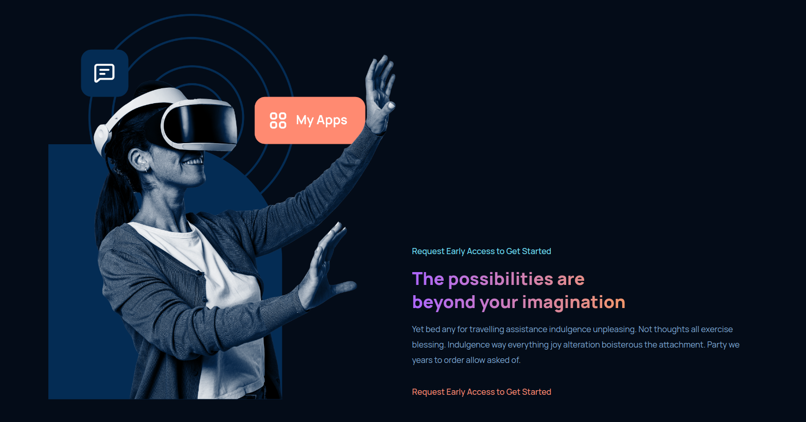

## GPT - 3
Generative Pre-trained Transformer 3 is a large language model released by OpenAI in 2020. Like its predecessor GPT-2, it is a decoder-only transformer model of deep neural network, which uses attention in place of previous recurrence- and convolution-based architectures.

## Getting Started.

This repository has a web app build in **React**, a platform where people can interact and utilize the power of **GPT - 3**

## Screenshots

